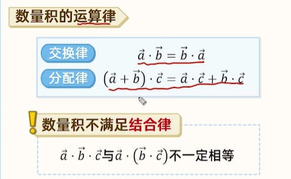
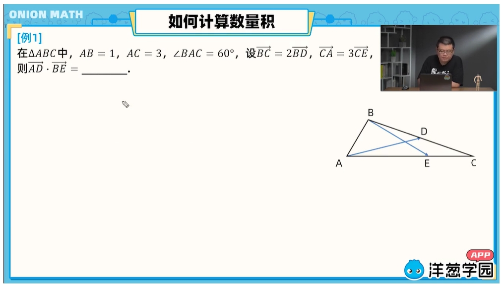
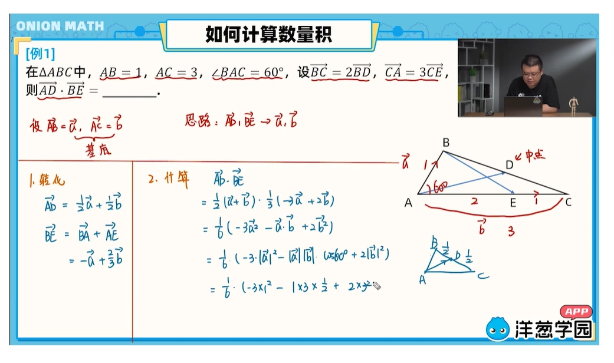
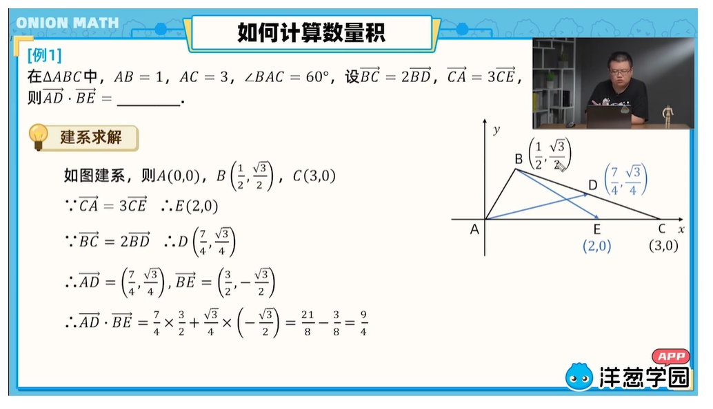
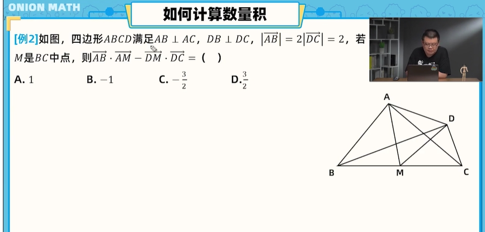
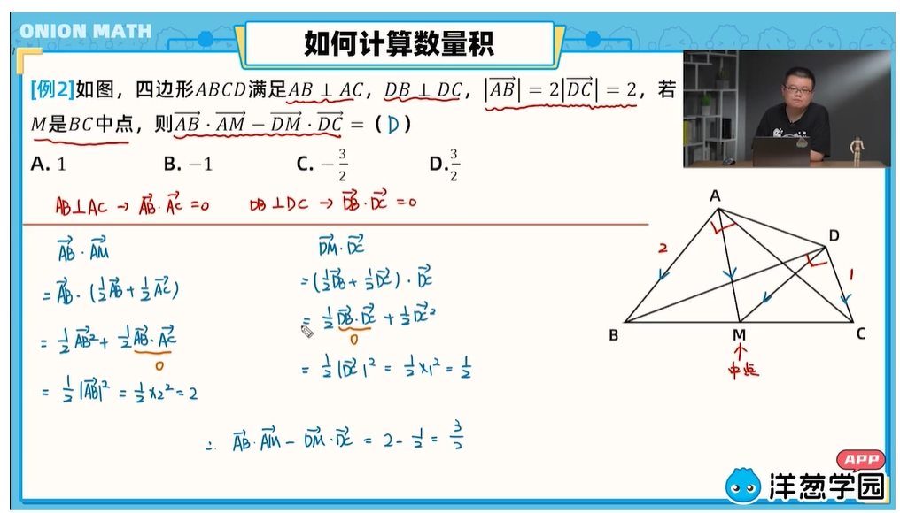

> title: 平面向量数量积
> published: 2024-10-13
> description: '，喵喵？'
> image: 'assets/images/demo-banner.jpg'
> tags: []
> category: ''
> draft: false 
> lang: 'zn-cn'

前言：

由于写了也没人看，所以自己随便瞎写写东西

上图属于平面向量数量积的基本定义

## 向量的夹角：

*向量的夹角是什么呢？*

向量的夹角是**共起点**的两个向量的夹角，不是共起点记得挪一下

注意：零向量与任意向量垂直

## 数量级的性质

直说吧，这仨不会这里的题啥题也别想算了

一定要记住

## 运算律

这也是基本性质了，也是不会的话啥题都算不了

## 计算

1.转化：题中有俩向量和他俩的夹角已知，不用想别个，直接都往他俩身上转就能算

*eg：*

像这种题想都不用想，直接转换，先把ad用AB,AC表示，然后be用AB,AC表示，之后用本文最上面的公式做下乘法就OK了

答案：

2.建系

这个更无脑

把A当原点。往上做X轴，往右做Y轴，然后把点都标出来，用上节课知识把所有向量坐标求出来同样乘一下就完事了

3.找垂直

这个在笔者做题中很少有题目单独考察，大多穿插在中等及高难题中，但也属于基本性质，必须掌握

eg:

答案

基本性质差不多就这样了，全部掌握后难度系数3以下基本都可以正常做了

但是要注意，难度系数3以下无法为您的高考拿到好的分数，必须做题熟悉各种灵活用法！
