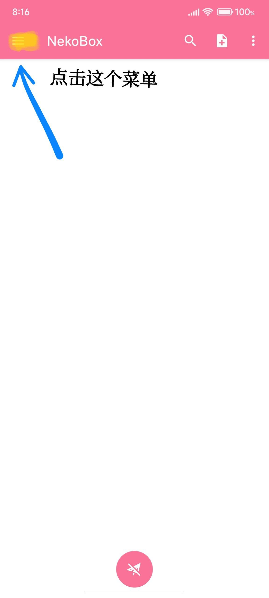
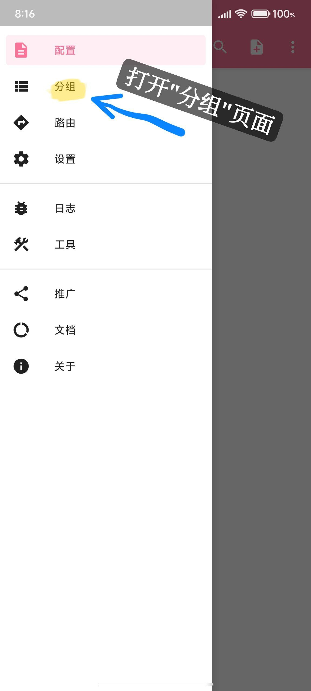
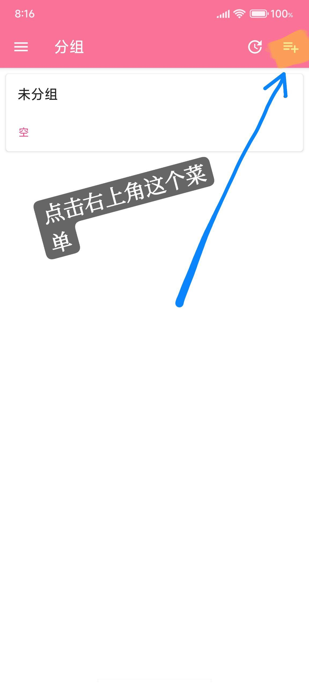
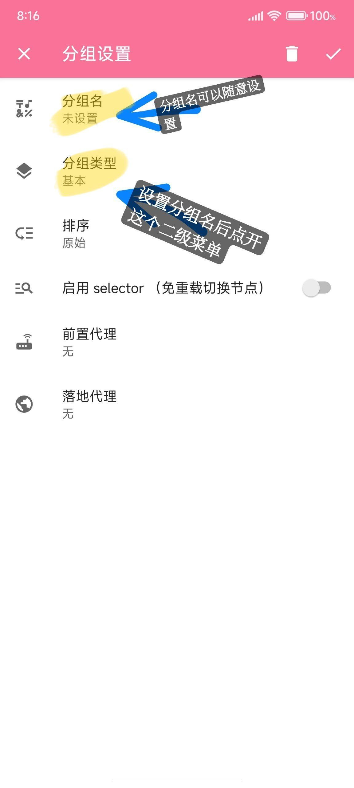
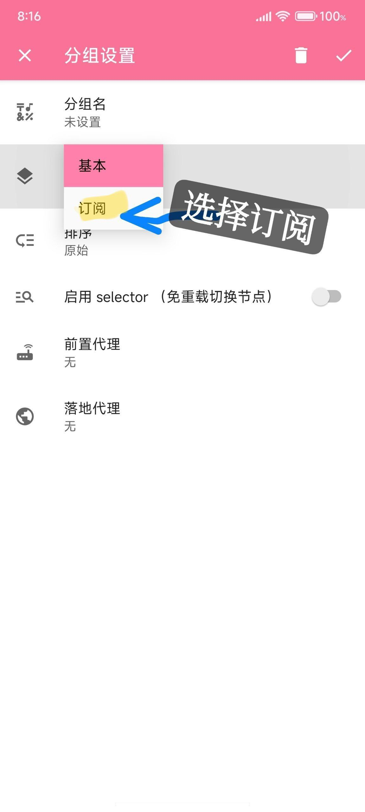
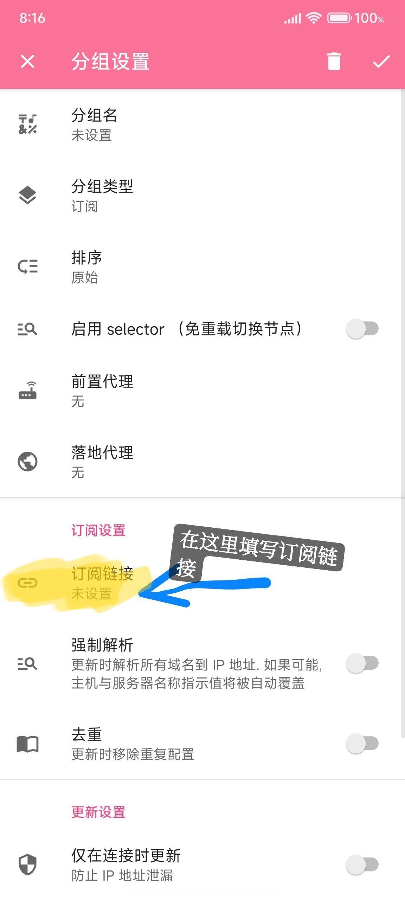
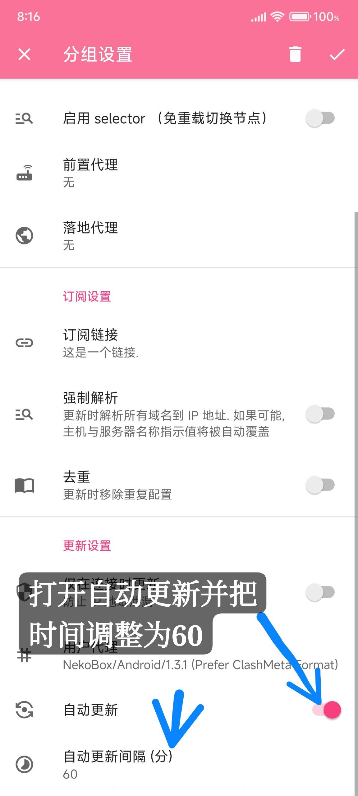
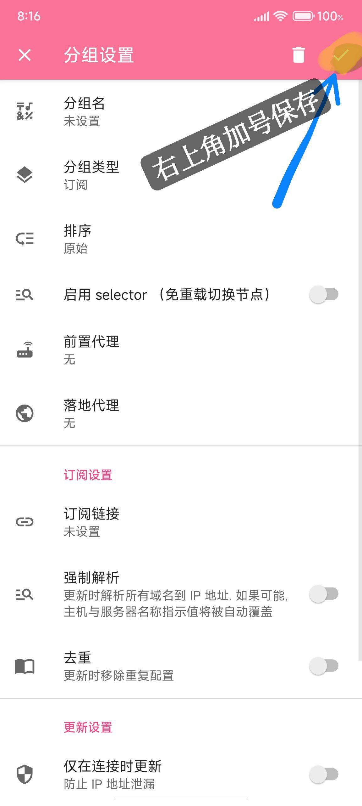
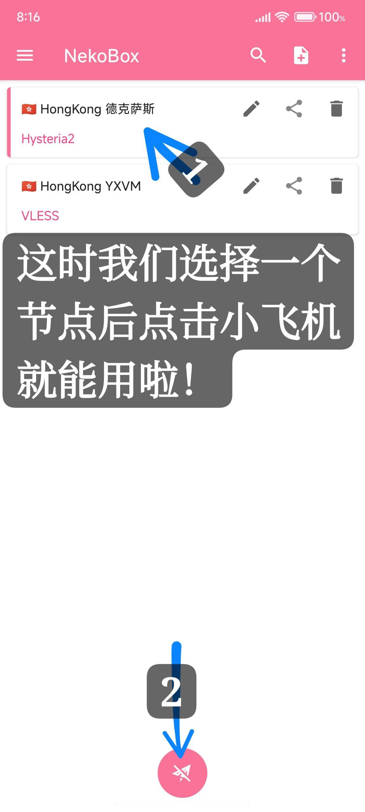

**请遵守您所在地区的法律法规。如果您位于中国大陆或其他禁止使用代理服务的国家/地区，请立即退出本页面！**

------

------

------

首先下载NekoBox

[点击此处下载](https://ghp.ci/https://github.com/MatsuriDayo/NekoBoxForAndroid/releases/download/1.3.2/NB4A-1.3.2-arm64-v8a.apk)

请在安装后按照以下步骤进行操作

请不要认为自己会就不看教程

> 教程省流：
>
> 添加订阅
>
> 自动更新时间调整为60分钟

**1.**点击左上角的“菜单栏”

**2.**打开“分组”页面

**3.**点击右上角的菜单栏

**4.**首先设置分组名（可随意设置，但注意不要超过字符限制），然后在“分组类型”这个二级菜单中选择“订阅”

**5.**向下翻，在订阅链接中填写我给你的链接

**6.**在下方的自动更新选项中，将“自动更新”打开，并将时间调整为“60分钟”

（为了保证可以用到我刚修复的内容）

**7.**点击右上角“对号”进行保存操作

**8.**划掉软件后台卡片并重新打开软件

**9.**在首页中选择一个节点并点击下面的“小飞机”就能正常用了！注意不要关闭这个软件的后台呦

